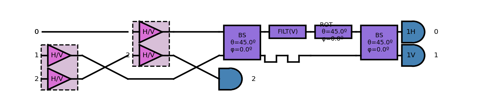

## Diagrams

> The above circuit represents a quantum teleporation from channel 0 to channel 2.

Questions:

Why do modes 1 and 2 overlap at two points?

I assume H/V is a superposition of horizontal and vertical polarisations?

Why do we alter the phase by 45 degrees in the 2nd last block prior to measuring horizontal and vertical polarisations?