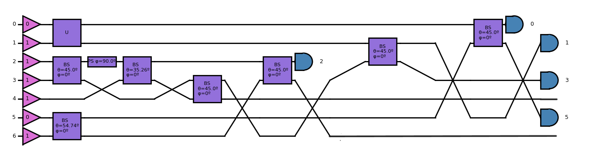

# Quantum Methods for Memory Attestation

A quantum teleportation-based implementation for secure remote memory attestation without trusted hardware dependencies.

## Overview

This project simulates quantum teleportation to implement a memory attestation protocol that verifies a remote device's memory state securely. The approach eliminates the need for trusted hardware, addressing supply chain vulnerabilities and insider threats commonly associated with traditional attestation methods.

**Quantum Lock's Novelty**: Uses quantum methods to authenticate a prover's memory state remotely, leveraging the fundamental properties of quantum mechanics for security guarantees.

## Implementation Details

The system is built on the `soqcs` library, which simulates quantum linear optics circuits. Our implementation includes:

- **Quantum Gates**: Pauli gates (X, Y, Z) and rotation gates
- **Quantum Teleportation**: Complete teleportation protocol simulation
- **Bell State Generation**: Non-deterministic entanglement generator with 1/9 success probability for maximally entangled Bell states
- **Bell State Analysis**: Linear optics-based Bell state measurement system

*Caveat: Only two out of the four Bell States can be distinguished and hence measured under the linear optics paradigm*

## Table of Contents
- [Protocol](#protocol)  
- [Quantum Teleportation Overview](#quantum-teleportation-overview)
- [Getting Started](#getting-started)
  - [Prerequisites](#prerequisites)
  - [Installation](#installation)
  - [Running the System](#running-the-system)
- [Usage](#usage)
- [Project Structure](#project-structure)
- [License](#license)
- [Acknowledgments](#acknowledgments)

## Protocol

The memory attestation protocol follows these steps:

Suppose the verifier $V$ and prover $P$ have shared a maximally entangled quantum state. $V$ has noticed the threat picture suggesting that there is a highly likely threat to remote devices. Therefore, $V$ needs to check with $P$ whether a particular device is in a compromised state.

1. **Challenge Generation**: Verifier uniformly samples a challenge $c \leftarrow \{0, 1\}^*$. An example of a potential challenge is forcing the device to do Horner's rule or perhaps random sampling of memory.

2. **Memory State Processing**: 
   - Prover has initial memory state $s_0$ which it needs to prove has not been compromised
   - Prover calculates $\mathrm{Attest}(s_0, c) = \theta'$
   - Prover prepares quantum state $\sin\left(\frac{\theta'}{2}\right)\ket{0} + \cos\left(\frac{\theta'}{2}\right)\ket{1}$ for teleportation

3. **Quantum Teleportation**: The state is teleported using the implemented quantum circuit. (Where the maximally entangled state is required)

4. **Verification**: Verifier measures the received state to validate memory integrity. It obtains the teleported state and rotates it via its own calculation of $\mathrm{Attest}(s, c) = \theta.$ The verifier then checks whether after the rotation their qubit is left in the $\ket{1}$ state. The verifier can also check the provers output $\mathrm{Attest}(s_0, c) = \theta'$ equals $\mathrm{Attest}(s, c) = \theta.$

*NOTE: For testing purposes the Attest function is abstracted.* 

## Quantum Teleportation Overview

Quantum teleportation enables "cutting and pasting" an arbitrary quantum state from sender to receiver across any distance.


*Example quantum teleportation circuit*

### How It Works

Consider two parties, the Peggy and Victor:

1. **Entanglement Generation**: They share a maximally entangled Bell state: $\frac{1}{\sqrt{2}}\left(\ket{0_P0_V} + \ket{1_P1_V}\right)$

2. **State Preparation**: Peggy prepares the quantum state $\psi_P$ to teleport. Within the context of our protocol this state is dependent on the output of $\mathrm{Attest}$

3. **Combined System**: The total system becomes $\psi_P \otimes \frac{1}{\sqrt{2}}\left(\ket{0_P0_V} + \ket{1_P1_V}\right)$

4. **Bell Measurement**: Peggy performs a Bell state measurement on their qubits

5. **Classical Communication**: Measurement results are sent to Victor

6. **State Recovery**: Victor applies appropriate operations to recover the original state


## Getting Started

### Prerequisites

Ensure you have Python 3.7+ and the following dependencies:

```bash
sudo apt install libeigen3-dev
pip install git+https://github.com/SOQCSAdmin/SOQCS
```

### Installation

1. **Clone the repository**:
   ```bash
   git clone https://github.com/actionable-wallet/quantum-mem-attest
   cd quantum-mem-attest
   ```

2. **Set up virtual environment** (recommended):
   ```bash
   python3 -m venv venv
   source venv/bin/activate  # On Windows: venv\Scripts\activate
   ```

<!-- 3. **Install dependencies**:
   ```bash
   pip install -r requirements.txt
   ``` -->

### Running the System

Execute `receiver.py` where a pseudo-random $\theta$ will be chosen which abstracts the $\mathrm{Attest}$ function.

```bash
python3 receiver.py
```

## Usage

### Configuration Options

Modify the following parameters in the source files:
- Memory state initialisation in `main.py`
- Challenge generation parameters in `receiver.py`
- Quantum circuit parameters for different attestation requirements

## Project Structure

```
quantum-mem-attest/src
├── main.py          # Prover 
└── receiver.py      # Verifier
```

- **`main.py`**: Implements the prover side of the protocol, handling memory state processing and quantum state preparation
- **`receiver.py`**: Implements the verifier side, managing challenge generation and state verification


